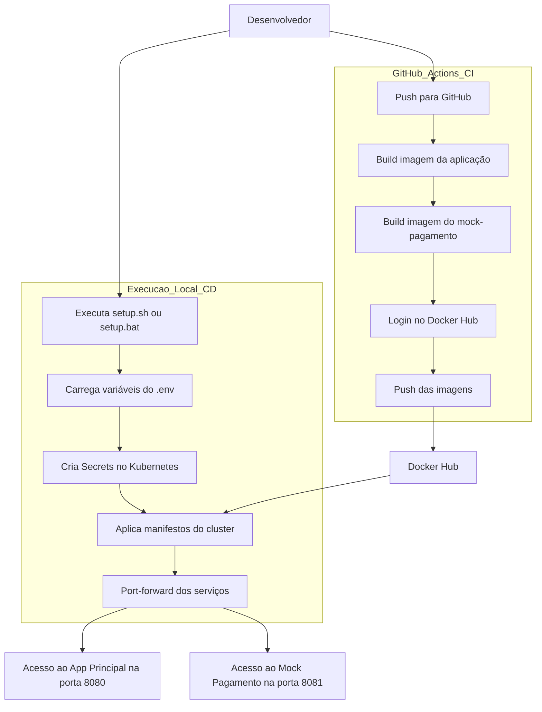
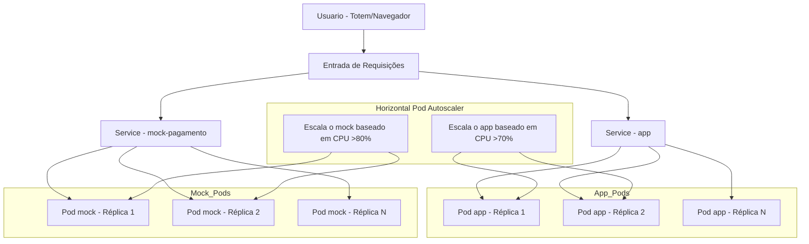
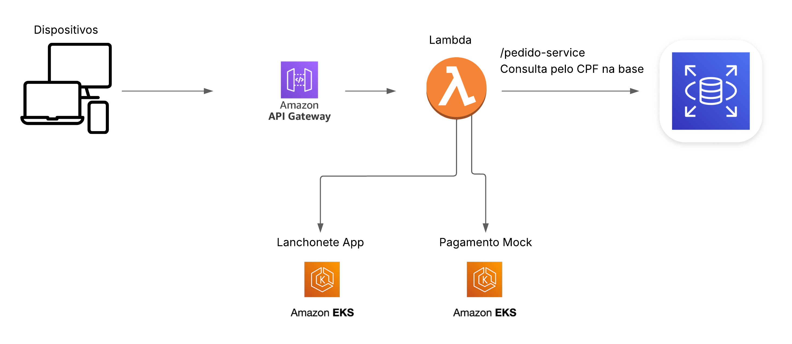
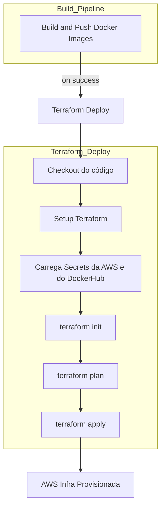

# FIAP Tech Challenge


[](https://github.com/ra1nmak3r1/tech_challenge_fiap/actions)
[](https://github.com/ns-fiap-tc/tech_challenge_fiap/actions/workflows/sonarcloud.yml)
[](https://github.com/ns-fiap-tc/tech_challenge_fiap/actions)

## 📖 Sobre o projeto

Tech Challenge do curso Software Architecture da FIAP.

### 1️⃣ Fase 1

> Aplicação desenvolvida utilizando arquitetura hexagonal que contempla a gestão dos pedidos de uma lanchonete.
>
> O código fonte inalterado desta fase ainda pode ser encontrado na branch [`release/v1.0.0`](https://github.com/ra1nmak3r1/tech_challenge_fiap/tree/release/v1.0.0)

### 2️⃣ Fase 2

> Migração da aplicação da arquitetura hexagonal para clean architecture.

### 📝 Sobre a refatoração na aplicacão para a Fase 2

1. Por conta do refactoring para clean architecture, uma situação que enfrentamos foi a ausência do contexto transacional do Spring na utilização das classes de negócios quando executavam o módulo de persistência (JPA), uma vez que as classes de negócios (\*UseCasesImpl) não estavam mais sendo gerenciadas pelo ApplicationContext do Spring. Como solução para este cenário, utilizamos AOP (Programação Orientada a Aspectos) para interceptar as chamadas aos métodos dos Controllers (que estão sendo gerenciados pelo Spring) para incluirmos cada execução em uma transação isolada.

2. Alteramos a estrutura do projeto em sub-módulos, sendo eles:

   - business: contém as classes de negócios, que fazem parte do core da aplicação e que podem ser executados com diferentes recursos externos, sendo utilizados os frameworks: lombok e mapstruct - ambos utilizados na geração de código em tempo de compilação.
   - app: contém as classes relacionadas aos frameworks e recursos utilizados para o correto funcionamento da aplicação.
   - pagamento-mock: aplicação apartada que simula a execução do Mercado Pago para efetivação do pagamento do pedido.

3. No módulo business, foram utilizados apenas os frameworks lombok e mapstruct.

   - O lombok é utilizado para a geração de métodos getters, setters, hashCode, equals e construtores.

   - Enquanto o mapstruct é utilizado para a criação de métodos que fazem o mapeamento dos atributos entre entidades para realização da cópia dos valores dos atributos de beans de classes diferentes.

4. Utilizamos os presenters apenas como sendo a transformação dos beans de domínio pra os DTOs a serem enviados para fora dos Controllers. Nesta implementação os DTOs são os mesmos utilizados no recebimento dos métodos externos e como informação a ser retornada, mas em caso de alteração da informação retornada, basta alterar o tipo de retorno dos métodos dos Controllers e os presenters.

<details>
  <summary>Detalhamento estrutura e execução na Fase 2</summary>

## 🏛️ Estrutura utilizada nos pacotes

```
raíz
├── app (módulo)
│   ├── Dockerfile
│   ├── pom.xml
│   └── src
│       └── application
│           ├──	device
│           │   ├── queue (produtores / consumidores)
│           │   ├── rest (interfaces)
│           │   │   ├── exception
│           │   │   │   └── handler
│           │   │   └── impl (implementações das interfaces)
│           │   └── persistence
│           │       ├── entity
│           │       ├── mapper
│           │       └── repository
│           └── infrastructure (local onde serão utilizadas as dependências de cada cloud ou de recursos externos)
│               ├── aspect (pacote contendo as classes da AOP)
│               ├── config (inclusão das configurações da aplicação, como por exemplo @Configuration do Spring, criando os @Bean)
│               ├── utils (classes utilitárias)
│               └── aws (pacotes específicos para cada cloud, por exemplo)
├── business (módulo)
│   ├── pom.xml
│   └── src
│       └── business (classes / interfaces referentes às regras de negócios da aplicação. criar as classes / interfaces sem usar frameworks - código o mais simples possível)
│           ├── adapter
│           │   ├── controller
│           │   ├── gateway
│           │   └── presenter
│           ├── common
│           │   ├── dto
│           │   ├── mapper
│           │   ├── queue (produtor / consumidor)
│           │   └── persistence
│           └── core
│               ├── domain (POJOs)
│               ├── exception
│               └── usecase (interfaces contendo os métodos a serem implementados)
│                   └── impl (implementações das interfaces)
└── pagamento-mock (módulo)
    ├── Dockerfile
    ├── pom.xml
    └── src
        └── pagamentomock
            ├── adapter
            │   ├── input
            │   │    ├── controller
            │	│    ├── dto
            │	│    └── mapper
            │	└── output
            └── infrastructure
                ├── config
                └── utils

```

## 💻 Tecnologias utilizadas na Aplicação

- Maven 3.9.9
- Spring Boot 3.3.4
- Java 17

## 📦 Arquitetura da Infraestrutura e CI/CD

### 🚀 Tecnologias Utilizadas na Infraestrutura

- **Minikube** — Cluster Kubernetes local para simular produção
- **Kubernetes (K8s)** — Orquestração dos recursos
- **Docker** — Empacotamento das aplicações em containers
- **Docker Compose** — Suporte ao ambiente de desenvolvimento local
- **GitHub Actions** — Pipeline de CI para build e deploy das imagens
- **Docker Hub** — Repositório para armazenar imagens da aplicação
- **Secrets e ConfigMaps** — Gestão segura de variáveis sensíveis no cluster
- **RabbitMQ(4.0.5) & PostgreSQL(16)** — Infraestrutura de mensageria e banco de dados

---

### ✅ Pré-requisitos para Execução

- **Docker** e **Docker Compose** instalados
- **Minikube** instalado e configurado localmente (Testes e validações realizados com a v1.35.0)
- Acesso ao `.env` com as variáveis necessárias

---

### 🛠️ Integração Contínua (CI)

O fluxo de CI é automatizado via **GitHub Actions** e é engatilhado a cada `push` na branch `main`.

1. Faz o checkout do repositório
2. Gera as imagens Docker de cada aplicação (`app` e `mock-pagamento`)
3. Faz o login no Docker Hub usando um **Access Token seguro**
4. Publica as imagens no Docker Hub (`app` em repositório privado e `mock-pagamento` em repositório público)

---

### 🌐 Deploy e Infraestrutura (CD)

A subida do ambiente é feita localmente via script `setup.sh` ou `setup.bat`, que:

1. Lê e carrega o arquivo `.env` com credenciais e configurações
2. Cria dinamicamente as Secrets no Kubernetes
3. Aplica todos os manifestos do cluster (PostgreSQL, RabbitMQ, app e mock)
4. Expõe os serviços via `port-forward` para acesso local (`localhost:8080`, `:8081`)

---

### 🧭 Fluxo da Arquitetura (CI/CD)



### 📈 Escalabilidade e HPA no Kubernetes

Para lidar com cenários de alta demanda, como por exemplo **lentidão no totem da lanchonete durante horários de pico**, a aplicação principal foi configurada com um recurso chamado **HPA (Horizontal Pod Autoscaler)** no Kubernetes.

O HPA monitora o uso de **CPU** do container da aplicação e **escala automaticamente o número de réplicas** (pods) quando a utilização ultrapassa um determinado limite configurado.

---

#### 📌 Exemplo de caso prático

> Cenário: durante o horário de almoço, há um grande volume de clientes utilizando o totem de autoatendimento. Isso gera lentidão e demora nas respostas da aplicação.

🔧 Solução:

- O HPA detecta que o uso de CPU no pod principal (`app`) ou no `mock-pagamento` está acima do limite (70% para o app, 80% para o mock)
- Ele automaticamente cria novos pods (`réplicas`) da aplicação para distribuir a carga
- Os **Services do Kubernetes** atuam como balanceadores de carga, redirecionando requisições para os pods disponíveis
- Quando o pico passa, o HPA reduz o número de pods novamente para economizar recursos

---

#### 🧭 Diagrama da Escalabilidade



---

#### 🧑‍💻 Considerações

- O **HPA está configurado para ambos os serviços**:
  - `app` com threshold de 70% de uso de CPU
  - `mock-pagamento` com threshold de 80% de uso de CPU
- O `app` pode escalar até **5 réplicas**, conforme demanda
- O `mock-pagamento` pode escalar até **3 réplicas**, conforme demanda
  > No `mock-pagamento` estamos apenas simulando um sistema externo de pagamentos, não necessariamente precisaríamos de um HPA nele, mas decidimos manter a configuração em uma escala menor

## ⚙️ Como executar a infraestrutura com Minikube

### ✅ 1. Pré-requisitos

Instale as ferramentas abaixo:

- [Docker](https://www.docker.com/products/docker-desktop/)
- [Minikube](https://minikube.sigs.k8s.io/docs/start/)

---

### ✅ 2. Clonar o repositório

```bash
git clone https://github.com/ra1nmak3r1/tech_challenge_fiap.git
cd tech_challenge_fiap
```

---

### ✅ 3. Criar o arquivo `.env` com base no `.env.example`

Já existe um arquivo de exemplo chamado **`.env.example`** no projeto.

<details>
  <summary><strong>🔐 COMO CONFIGURAR O ARQUIVO .ENV</strong></summary>

1. Copie o arquivo `.env.example` para `.env`:

```bash
cp .env.example .env  # Linux ou Mac
```

```powershell
copy .env.example .env  # Windows
```

2. Substitua os valores fictícios pelos **valores reais que foram enviados separadamente**.

> ⚠️ Os valores do `.env.example` são apenas ilustrativos e não funcionais.

</details>

---

### ✅ 4. Subir a infraestrutura

Foram desenvolvidos scripts em `.sh` e `.bat` para facilitar a inicialização da infraestrutura no Minikube, sem que seja necessário executar os comandos da API do Kubernetes para tal. Na prática ambos os scripts fazem o seguinte:

1. ✅ Verifica se o arquivo `.env` existe e carrega suas variáveis
2. 🔐 Cria dinamicamente as **Secrets** no Kubernetes com base no `.env`
3. 🐳 Cria uma Secret para autenticação no **Docker Hub** (para acesso à imagem privada da aplicação principal)
4. 🚀 Inicializa o cluster local do **Minikube**
5. 📂 Aplica todos os **manifestos Kubernetes** da aplicação:
   - Banco de dados PostgreSQL
   - RabbitMQ
   - Aplicação principal (`app`)
   - Serviço de mock de pagamento (`mock-pagamento`)
6. 🌐 Expõe os serviços localmente via `kubectl port-forward`, permitindo acesso via `localhost`
7. ⏳ Aguarda os pods ficarem prontos antes de liberar o acesso

> ℹ️ Em cerca de 3-4 minutos, o ambiente estará funcionando localmente com todos os microsserviços no ar.

#### ▶️ Linux ou Mac:

```bash
chmod +x setup.sh
./setup.sh
```

#### 🪟 Windows:

```powershell
.\setup.bat
```

---

### ✅ 5. Acessar os serviços localmente

| Serviço        | URL                   |
| -------------- | --------------------- |
| Aplicação      | http://localhost:8080 |
| Mock Pagamento | http://localhost:8081 |

---

### 🛠️ Comandos úteis para observação

Ver todos os pods:

```bash
kubectl get pods
```

Ver logs da aplicação principal:

```bash
kubectl logs -l app=lanchonete-app -f
```

Ver logs do mock pagamento:

```bash
kubectl logs -l app=mock-pagamento -f
```

---

### 🧹 Resetar tudo (opcional)

Caso queira limpar o ambiente e recomeçar do zero, preparamos os seguintes executáveis para facilitar o processo:

#### ▶️ Linux ou Mac

```bash
./delete_setup.sh
```

#### 🪟 Windows

```powershell
.\delete_setup.bat
```

Ou, você também pode zerar o minikube por completo se desejar

```bash
minikube delete
```

## 📄 Acesso à documentação das APIs

#### Aplicação

- http://localhost:8080/api-docs (endpoints)
- http://localhost:8080/swagger-ui/index.html (swagger-ui)

#### Pagamento Mock

- http://localhost:8081/api-docs (endpoints)
- http://localhost:8081/swagger-ui/index.html (swagger-ui)

## 🧪 Execução em modo de Desenvolvimento (sem Minikube)

<details>

<summary>Se desejar executar a aplicação em modo de desenvolvimento local para debugar e alterar o código fonte em caráter de teste, siga este passo a passo</summary>

#### ✅ 1. Pré-requisitos

- Docker
- Docker Compose
- Maven 3.9.9
- Spring Boot 3.3.4
- Java 17

---

#### ✅ 2. Gerar o `.env`

Crie o arquivo `.env` com base no `.env.example`, da mesma forma descrita anteriormente:

```bash
cp .env.example .env  # Linux ou Mac
```

```powershell
copy .env.example .env  # Windows
```

Substitua os valores conforme os dados enviados.

---

#### ✅ 3. Buildar as aplicações localmente (apenas na primeira vez)

Primeiro instale o pacote parent da aplicação, através do comando:

```bash
mvn -DskipTests -DskipITs=true -N clean install
```

Em seguida, compile o projeto e gere o arquivo `.jar`. Para isso, execute:

```bash
mvn -DskipTests clean package
```

---

#### ✅ 4. Subir o ambiente de desenvolvimento com Docker Compose

Na raiz do projeto, execute:

```bash
docker compose up --build
```

Isso irá:

- Buildar os containers da aplicação principal e do mock
- Subir o banco de dados PostgreSQL e o RabbitMQ
- Conectar todos os serviços em rede local

---

#### ✅ 5. Acessar os serviços localmente

| Serviço        | URL                   |
| -------------- | --------------------- |
| Aplicação      | http://localhost:8080 |
| Mock Pagamento | http://localhost:8081 |

</details>

## 🔄 Fluxo de Execução

### 1. Criação de um novo pedido

```
POST -> /pedido-service/v1/save
```

---

### 2. Atualização dos itens do pedido

```
PUT -> /pedido-service/v1/save/:id
```

Esta atualização contempla:

- Os **itens do pedido**
- As **informações de pagamento**
- O **status do pedido**

> O ID do objeto pagamento deve ser preenchido.

Caso o status seja alterado para `RECEBIDO`, isso significa que o pedido foi finalizado pelo usuário e agora será feito o **processamento do pagamento**, que ocorrerá de forma assíncrona, utilizando o projeto **Pagamento Mock**.

---

### 3. Confirmação do Pagamento

Para confirmar que o pagamento foi realizado, é necessário executar o endpoint abaixo do **Pagamento Mock**, que por sua vez **executará o webhook da aplicação**.

**Endpoint do Pagamento Mock:**

```
POST -> /pagamento-mock-service/v1/callPagamentoWebHook/:pedidoId/:aprovarPagamento
```

**Webhook da aplicação:**

```
POST -> /pagamento-service/v1/updateStatus/:pedidoId/:statusCode
```

### Observações

- Ambos os métodos foram definidos como `POST` por não serem indepotentes.
- A execução do webhook, caso receba o `statusCode = 100`, significa que o pagamento foi realizado com sucesso, e fará com que o pedido seja **confirmado** e as **Ordens de Serviço sejam criadas para a cozinha**.

</details>

### 3️⃣ Fase 3

> Migração da aplicação para AWS, automatizando a criação da infra-estrutura com o terraform.

1. O banco de dados foi migrado para a AWS RDS utilizando o engine do PostgreSQL, que era o banco que já era usado pela aplicação. Não foram realizadas alterações na estrutura da base de dados, por já existirem todos os campos necessários.

2. Foi incluída a utilização do serviço AWS Lambda para consultar a existência do CPF do cliente na base de dados, caso seja informado inicialmente. Sendo incluído o CPF no JWT que será criado neste momento. Caso não exista ou não seja informado, o JWT será criado com CPF vazio.

3. Dentro da pasta `terraform` contém códigos Terraform para provisionar os deployments necessários para rodar a aplicação.

<details>
  <summary>Detalhamento estrutura e execução na Fase 3</summary>

## 🔁 Fluxo da requisição na AWS



## 👟 Passos para o provisionamento
Este projeto faz parte de um ecossistema maior, composto por múltiplos repositórios que se comunicam entre si e também utilizam GitHub Actions para provisionamento ou deploy automatizado.

Para completo funcionamento da plataforma, é necessário seguir o seguinte fluxo de provisionamento:

> 1. A provisão do repositório da infra-base; [`infra-base`](https://github.com/ns-fiap-tc/infra-base);
> 2. A provisão do repositório do banco de dados: [`infra-bd`](https://github.com/ns-fiap-tc/infra-bd);
> 3. A provisão deste repositório [`tech_challenge_fiap`]([#como-rodar-o-projeto](https://github.com/ns-fiap-tc/tech_challenge_fiap?tab=readme-ov-file#como-rodar-o-projeto));
> 4. A provisão da lambda e api gateway: [`lambda`](https://github.com/ns-fiap-tc/lambda)

> ⚠️ Todos os workflows são configurados para serem disparados com segurança usando variáveis armazenadas via GitHub Secrets.

## 🚀 Como rodar o projeto

### 🤖 Via Github Actions
<details>
  <summary>Passo a passo</summary>

#### 📖 Resumo
Após o build e publicação das imagens Docker da aplicação (realizado na pipeline `Build and Push Docker Images`), uma **segunda pipeline é acionada automaticamente** com o objetivo de **provisionar a infraestrutura na AWS utilizando Terraform**.
Este processo é orquestrado pelo workflow `Terraform Deploy`.
> Neste caso, somente os membros da equipe que fazem parte do projeto podem utilizar este fluxo.

#### 🔐 Pré-requisitos
Antes de utilizar esse fluxo, é necessário que as seguintes **secrets** estejam configuradas no repositório no GitHub:
- `AWS_ACCESS_KEY_ID`
- `AWS_SECRET_ACCESS_KEY`
- `AWS_SESSION_TOKEN` *(se estiver usando AWS Academy)*
- `TF_VAR_db_username`
- `TF_VAR_db_password`
- `DOCKERHUB_USERNAME`
- `DOCKERHUB_ACCESS_TOKEN`

Essas variáveis são utilizadas pelo Terraform para acessar a AWS, provisionar a infraestrutura e autenticar no Docker Hub para baixar as imagens da aplicação.

> Você pode configurar essas secrets em: `Settings > Secrets and variables > Actions`

#### ⚙️ Etapas do Deploy via GitHub Actions:
1. ✅ **Disparo automático**: A action é iniciada **somente após a finalização com sucesso** da pipeline de build (`workflow_run.conclusion == 'success'`).
2. 🧾 **Checkout do código**: A action clona o repositório na VM temporária usada pela GitHub Action.
3. ⚒️ **Configuração do Terraform**: A ferramenta `terraform` é instalada no ambiente.
4. 📁 **Acesso à pasta `terraform/`**: Todas as ações ocorrem dentro dessa pasta, que contém os arquivos `.tf`.
5. 🔐 **Carregamento de variáveis sensíveis**:
   - Credenciais da AWS (`AWS_ACCESS_KEY_ID`, `AWS_SECRET_ACCESS_KEY`, `AWS_SESSION_TOKEN`)
   - Credenciais de banco (`TF_VAR_db_username`, `TF_VAR_db_password`)
   - Credenciais do Docker Hub
6. 🧪 **Execução do `terraform init`**: Inicializa os plugins e configurações da infraestrutura.
7. 🔍 **Execução do `terraform plan`**: Exibe no log o que será criado/modificado/destruído na AWS.
8. 🚀 **Execução do `terraform apply`**: Provisiona automaticamente a infraestrutura, sem necessidade de confirmação (`-auto-approve`).

#### 🧭 Diagrama do Fluxo de Execução


#### Benefícios desse fluxo
- 💡 Automação completa: nenhuma intervenção manual é necessária após o push.
- 🔐 Segurança: uso de GitHub Secrets para variáveis sensíveis.
- 🔁 Reprodutibilidade: o mesmo ambiente pode ser criado quantas vezes for necessário.
- 📦 Infra como código (IaC): toda a infraestrutura é descrita em arquivos .tf, versionados no repositório.
</details>

### 💻 Localmente

<details>
  <summary>Passo a passo</summary>

#### Pré-requisitos

Antes de começar, certifique-se de ter os seguintes itens instalados e configurados em seu ambiente:

1. **Terraform**: A ferramenta que permite definir, visualizar e implantar a infraestrutura de nuvem.
2. **AWS CLI**: A interface de linha de comando da AWS.
3. **Credenciais AWS válidas**: Você precisará de uma chave de acesso e uma chave secreta para autenticar com a AWS (no momento, o repositório usa chaves e credenciais fornecidas pelo [AWS Academy](https://awsacademy.instructure.com/) e que divergem de contas padrão). Tais credenciais devem ser inseridas no arquivo `credentials` que fica dentro da pasta `.aws`

## Como usar

1. **Clone este repositório**:

```bash
git clone https://github.com/ns-fiap-tc/tech_challenge_fiap
```

2. **Acesse o diretório do repositório**:

```bash
cd tech_challenge_fiap
```

3. **Defina as variáveis necessárias ao nível de ambiente, criando um arquivo `.env` de acordo com o arquivo `.env.exemplo`. Exemplo:**:

```bash
DOCKERHUB_USERNAME="dockerhub_username"
DOCKERHUB_ACCESS_TOKEN="dokerhub_token"
```

4. **Inicialize o diretório Terraform**:

```bash
terraform init
```

5. **Visualize as mudanças que serão feitas**:

```bash
./terraform.sh plan
```

6. **Provisione a infraestrutura**:

```bash
./terraform.sh apply -auto-approve
```

7. **Para destruir a infraestrutura provisionada**:

```bash
./terraform.sh destroy -auto-approve
```

</details>

## 🧱 Sobre o Terraform
Este e todos os demais repositórios do projeto usam Terraform para provisionar e gerenciar a infraestrutura da aplicação na AWS

### 🧠 Utilização de backend remoto (`backend.tf`)
Por padrão, o Terraform armazena o **state file** (arquivo `terraform.tfstate`) localmente. Esse arquivo contém o "espelho" do que foi criado na infraestrutura, e é com base nele que o Terraform sabe **o que existe**, **o que precisa ser criado**, **modificado** ou **destruído**.

Em ambientes colaborativos ou com automação via CI/CD, usar o estado local **não é seguro** nem escalável.

Sendo assim, para garantir a **consistência do estado da infraestrutura** e permitir que múltiplos usuários/triggers CI/CD compartilhem o mesmo controle da stack, configuramos o Terraform para utilizar um **backend remoto** no **Amazon S3** com controle de concorrência via **DynamoDB**.

#### 🪣 1. Amazon S3 - Armazenamento seguro do state
O arquivo `terraform.tfstate` é armazenado dentro de um bucket no S3. Isso garante:

- 🧩 Que **todos os desenvolvedores e pipelines** usem o mesmo estado compartilhado
- 🔐 Que o arquivo esteja em um ambiente seguro, com **criptografia habilitada**
- 🕒 Histórico de versões automático, se habilitado no bucket

Exemplo de configuração:

```hcl
bucket = "nome-do-bucket-terraform"
key    = "tech-challenge/infra/terraform.tfstate"
```

#### 🔒 2. DynamoDB - Controle de concorrência com locking
Para evitar que **duas execuções do Terraform ocorram ao mesmo tempo** (por exemplo, dois devs ou um dev + CI), utilizamos **locking via tabela DynamoDB**.

Isso evita corrupção no `tfstate`, garantindo que apenas **uma execução ocorra por vez**.

```hcl
dynamodb_table = "terraform-locks"
```

O Terraform cria um "lock" temporário enquanto o plano/aplicação está em execução e remove ao final. Se algo falhar e o lock não for removido, podemos desbloquear manualmente.

#### 📌 Funcionamento resumido

```text
terraform init
│
├── Lê o arquivo backend.tf
│
├── Conecta com o bucket S3 e tabela DynamoDB
│
├── Verifica se já existe um state remoto
│     └── Se sim: sincroniza o local com o remoto
│     └── Se não: cria um novo .tfstate no S3
│
├── Ao executar terraform apply:
│     ├── Cria lock temporário na tabela DynamoDB
│     ├── Aplica as mudanças
│     └── Atualiza o tfstate no bucket S3
│     └── Libera o lock no DynamoDB
```
> Para observar isso na prática, perceba que ao executar `terraform init`, nos logs vai constar a conexão com o backend remoto.

#### ✅ Benefícios dessa abordagem
- 👥 **Trabalho em equipe sem conflitos**
- 🔁 **Execução segura via CI/CD**
- ☁️ **State persistente e acessível de qualquer lugar**
- 🛡️ **Proteção contra concorrência com lock automático**

</details>


### 4️⃣ Fase 4

Microservicos existentes nesta fase do projeto:

- Categoria - utiliza banco de dados PostgreSQL.
- Pagamento - utiliza banco de dados MongoDB.
- Pagamento-Mock (já existente previamente) - não utiliza banco de dados, simula o processo do Mercado Pago.
- Produto - utiliza banco de dados PostgreSQL.

Os testes unitários são realizados end-to-end, com o banco de dados sendo executado em container a partir do framework Testcontainer a partir dos próprios testes.  Para a correta execução, o ambiente que executará os testes deve estar com o serviço do docker em execução.

Nesta abordagem foram utilizados mocks apenas nos clientes dos serviços externos, e mesmo assim foi verificada a execução dos métodos dos mocks.

Para uma melhor utilização e manutenção de componentes compartilhados por mais de um microserviço, foram criados alguns pacotes com classes auxiliares, são eles:

- categoria-commons
- pagamento-commons
- pedido-commons
- produto-commons

#### Cobertura de Testes
Abaixo evidência de cobertura dos testes + link de referência para os dados do Sonar


- Link Sonar: https://sonarcloud.io/summary/new_code?id=ns-fiap-tc_tech_challenge_fiap&branch=main

<details>
  <summary>Detalhamento execução na Fase 4</summary>

## 👟 Passos para o provisionamento
Este projeto faz parte de um ecossistema maior, composto por múltiplos repositórios que se comunicam entre si e também utilizam GitHub Actions para provisionamento ou deploy automatizado.

> Para completo funcionamento da plataforma, é necessário seguir o seguinte fluxo de provisionamento:
> 1. A provisão deste repositório; [infra-base](https://github.com/ns-fiap-tc/infra-base)
> 2. A provisão do repositório dos bancos de dados: [infra-bd](https://github.com/ns-fiap-tc/infra-bd);
> 3. A provisão do repositório do microsserviço de categoria: [tech_challenge_fiap_ms_categoria](https://github.com/ns-fiap-tc/tech_challenge_fiap_ms_categoria);
> 4. A provisão do repositório do microsserviço de produto: [tech_challenge_fiap_ms_produto](https://github.com/ns-fiap-tc/tech_challenge_fiap_ms_produto);
> 5. A provisão do repositório do microsserviço de pagamento e pagamento-mock: [tech_challenge_fiap_ms_pagamento](https://github.com/ns-fiap-tc/tech_challenge_fiap_ms_pagamento);
> 6. A provisão da aplicação principal: [tech_challenge_fiap](#como-rodar-o-projeto).


> ⚠️ Todos os workflows são configurados para serem disparados com segurança usando variáveis armazenadas via GitHub Secrets.

## 🚀 Como rodar o projeto

### 🤖 Via Github Actions
<details>
  <summary>Passo a passo</summary>

#### 📖 Resumo
Após o build e publicação das imagens Docker da aplicação (realizado na pipeline `Build and Push Docker Images`), uma **segunda pipeline é acionada automaticamente** com o objetivo de **provisionar a infraestrutura na AWS utilizando Terraform**.
Este processo é orquestrado pelo workflow `Terraform Deploy`.
> Neste caso, somente os membros da equipe que fazem parte do projeto podem utilizar este fluxo.

#### 🔐 Pré-requisitos
Antes de utilizar esse fluxo, é necessário que as seguintes **secrets** estejam configuradas no repositório no GitHub:
- `AWS_ACCESS_KEY_ID`
- `AWS_SECRET_ACCESS_KEY`
- `AWS_SESSION_TOKEN` *(se estiver usando AWS Academy)*
- `TF_VAR_db_username`
- `TF_VAR_db_password`
- `DOCKERHUB_USERNAME`
- `DOCKERHUB_ACCESS_TOKEN`

Essas variáveis são utilizadas pelo Terraform para acessar a AWS, provisionar a infraestrutura e autenticar no Docker Hub para baixar as imagens da aplicação.

> Você pode configurar essas secrets em: `Settings > Secrets and variables > Actions`

#### ⚙️ Etapas do Deploy via GitHub Actions:
1. ✅ **Disparo automático**: A action é iniciada **somente após a finalização com sucesso** da pipeline de build (`workflow_run.conclusion == 'success'`).
2. 🧾 **Checkout do código**: A action clona o repositório na VM temporária usada pela GitHub Action.
3. ⚒️ **Configuração do Terraform**: A ferramenta `terraform` é instalada no ambiente.
4. 📁 **Acesso à pasta `terraform/`**: Todas as ações ocorrem dentro dessa pasta, que contém os arquivos `.tf`.
5. 🔐 **Carregamento de variáveis sensíveis**:
   - Credenciais da AWS (`AWS_ACCESS_KEY_ID`, `AWS_SECRET_ACCESS_KEY`, `AWS_SESSION_TOKEN`)
   - Credenciais de banco (`TF_VAR_db_username`, `TF_VAR_db_password`)
   - Credenciais do Docker Hub
6. 🧪 **Execução do `terraform init`**: Inicializa os plugins e configurações da infraestrutura.
7. 🔍 **Execução do `terraform plan`**: Exibe no log o que será criado/modificado/destruído na AWS.
8. 🚀 **Execução do `terraform apply`**: Provisiona automaticamente a infraestrutura, sem necessidade de confirmação (`-auto-approve`).

#### 🧭 Diagrama do Fluxo de Execução


#### Benefícios desse fluxo
- 💡 Automação completa: nenhuma intervenção manual é necessária após o push.
- 🔐 Segurança: uso de GitHub Secrets para variáveis sensíveis.
- 🔁 Reprodutibilidade: o mesmo ambiente pode ser criado quantas vezes for necessário.
- 📦 Infra como código (IaC): toda a infraestrutura é descrita em arquivos .tf, versionados no repositório.
</details>

### 💻 Localmente

<details>
  <summary>Passo a passo</summary>

#### Pré-requisitos

Antes de começar, certifique-se de ter os seguintes itens instalados e configurados em seu ambiente:

1. **Terraform**: A ferramenta que permite definir, visualizar e implantar a infraestrutura de nuvem.
2. **AWS CLI**: A interface de linha de comando da AWS.
3. **Credenciais AWS válidas**: Você precisará de uma chave de acesso e uma chave secreta para autenticar com a AWS (no momento, o repositório usa chaves e credenciais fornecidas pelo [AWS Academy](https://awsacademy.instructure.com/) e que divergem de contas padrão). Tais credenciais devem ser inseridas no arquivo `credentials` que fica dentro da pasta `.aws`

## Como usar

1. **Clone este repositório**:

```bash
git clone https://github.com/ns-fiap-tc/tech_challenge_fiap
```

2. **Acesse o diretório do repositório**:

```bash
cd tech_challenge_fiap
```

3. **Defina as variáveis necessárias ao nível de ambiente, criando um arquivo `.env` de acordo com o arquivo `.env.exemplo`. Exemplo:**:

```bash
DOCKERHUB_USERNAME="dockerhub_username"
DOCKERHUB_ACCESS_TOKEN="dokerhub_token"
```

4. **Inicialize o diretório Terraform**:

```bash
terraform init
```

5. **Visualize as mudanças que serão feitas**:

```bash
./terraform.sh plan
```

6. **Provisione a infraestrutura**:

```bash
./terraform.sh apply -auto-approve
```

7. **Para destruir a infraestrutura provisionada**:

```bash
./terraform.sh destroy -auto-approve
```

</details>

## 🧱 Sobre o Terraform
Este e todos os demais repositórios do projeto usam Terraform para provisionar e gerenciar a infraestrutura da aplicação na AWS

### 🧠 Utilização de backend remoto (`backend.tf`)
Por padrão, o Terraform armazena o **state file** (arquivo `terraform.tfstate`) localmente. Esse arquivo contém o "espelho" do que foi criado na infraestrutura, e é com base nele que o Terraform sabe **o que existe**, **o que precisa ser criado**, **modificado** ou **destruído**.

Em ambientes colaborativos ou com automação via CI/CD, usar o estado local **não é seguro** nem escalável.

Sendo assim, para garantir a **consistência do estado da infraestrutura** e permitir que múltiplos usuários/triggers CI/CD compartilhem o mesmo controle da stack, configuramos o Terraform para utilizar um **backend remoto** no **Amazon S3** com controle de concorrência via **DynamoDB**.

#### 🪣 1. Amazon S3 - Armazenamento seguro do state
O arquivo `terraform.tfstate` é armazenado dentro de um bucket no S3. Isso garante:

- 🧩 Que **todos os desenvolvedores e pipelines** usem o mesmo estado compartilhado
- 🔐 Que o arquivo esteja em um ambiente seguro, com **criptografia habilitada**
- 🕒 Histórico de versões automático, se habilitado no bucket

Exemplo de configuração:

```hcl
bucket = "nome-do-bucket-terraform"
key    = "tech-challenge/infra/terraform.tfstate"
```

#### 🔒 2. DynamoDB - Controle de concorrência com locking
Para evitar que **duas execuções do Terraform ocorram ao mesmo tempo** (por exemplo, dois devs ou um dev + CI), utilizamos **locking via tabela DynamoDB**.

Isso evita corrupção no `tfstate`, garantindo que apenas **uma execução ocorra por vez**.

```hcl
dynamodb_table = "terraform-locks"
```

O Terraform cria um "lock" temporário enquanto o plano/aplicação está em execução e remove ao final. Se algo falhar e o lock não for removido, podemos desbloquear manualmente.

#### 📌 Funcionamento resumido

```text
terraform init
│
├── Lê o arquivo backend.tf
│
├── Conecta com o bucket S3 e tabela DynamoDB
│
├── Verifica se já existe um state remoto
│     └── Se sim: sincroniza o local com o remoto
│     └── Se não: cria um novo .tfstate no S3
│
├── Ao executar terraform apply:
│     ├── Cria lock temporário na tabela DynamoDB
│     ├── Aplica as mudanças
│     └── Atualiza o tfstate no bucket S3
│     └── Libera o lock no DynamoDB
```
> Para observar isso na prática, perceba que ao executar `terraform init`, nos logs vai constar a conexão com o backend remoto.

#### ✅ Benefícios dessa abordagem
- 👥 **Trabalho em equipe sem conflitos**
- 🔁 **Execução segura via CI/CD**
- ☁️ **State persistente e acessível de qualquer lugar**
- 🛡️ **Proteção contra concorrência com lock automático**

</details>


## ✨ Contribuidores

- Guilherme Fausto - RM 359909
- Nicolas Silva - RM 360621
- Rodrigo Medda Pereira - RM 360575

## Licença

[](./LICENSE)
